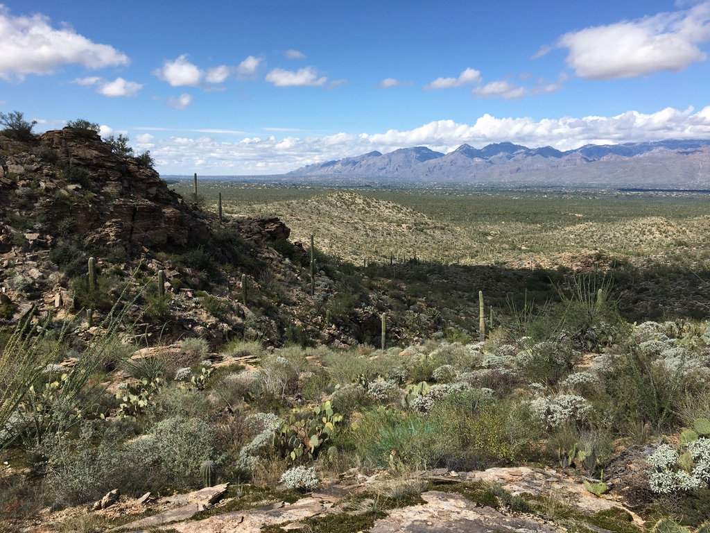
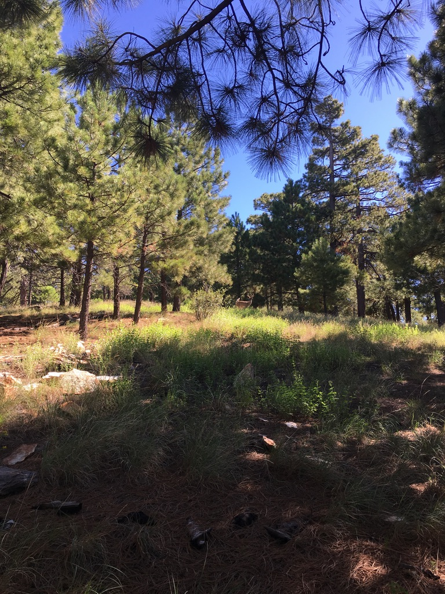

As an intern within the resource management division, my job was primarily to help control invasive plant life in the park. Invasives like buffelgrass crowd out native plants, including the iconic Saguaro cactus. Buffelgrass is a dense, dry plant that’s susceptible to, and adapted for frequent fires. Native life has evolved to sustain only infrequent fires. Buffelgrass fuels bigger burns, and gains ground in the aftermath, rapidly proliferating in areas cleared by the flames. I spent the latter half of 2018 fighting buffelgrass and other invasive grasses in a variety of ways:

1. Systematic surveys to find and digitally map invasive plants.
2. Chemical and physical removal. My crew mixed and applied herbicide using backpack sprayers.
3. Using GIS software I divided subsections of the park into treatment units based on topography, the stream network, and a cardinally-aligned grid.
4. I wrote a Python script to run within GIS software to automate the prioritization of treatment units based on factors including number of invasive plants present, invasive density, invasive clustering, and time since treatment.

The internship is designed as an educational experience—I gained so many valuable skills and experiences beyond invasive plant control.

- Wilderness First Aid and Basic Life Support training.
- I surveyed and recorded water presence and depth in desert washes.
- In the Rincon mountains, I systematically mapped cultural resources, invasive plants, rare native plants, riparian indicators, springs, bark beetle infestations, and other forest health indicators.
- I cleaned, diagnosed, and repaired backpack sprayers.
- And I managed the [Saguaro National Park Twitter account](https://twitter.com/SaguaroNPS).

*A view of the low hills of the Rincon Mountain District of Saguaro National Park, with Tucson in the distance.*

*A view of the a forest and a lone antlered dear near Spud Rock in the Rincon Mountains of Saguaro National Park.*
