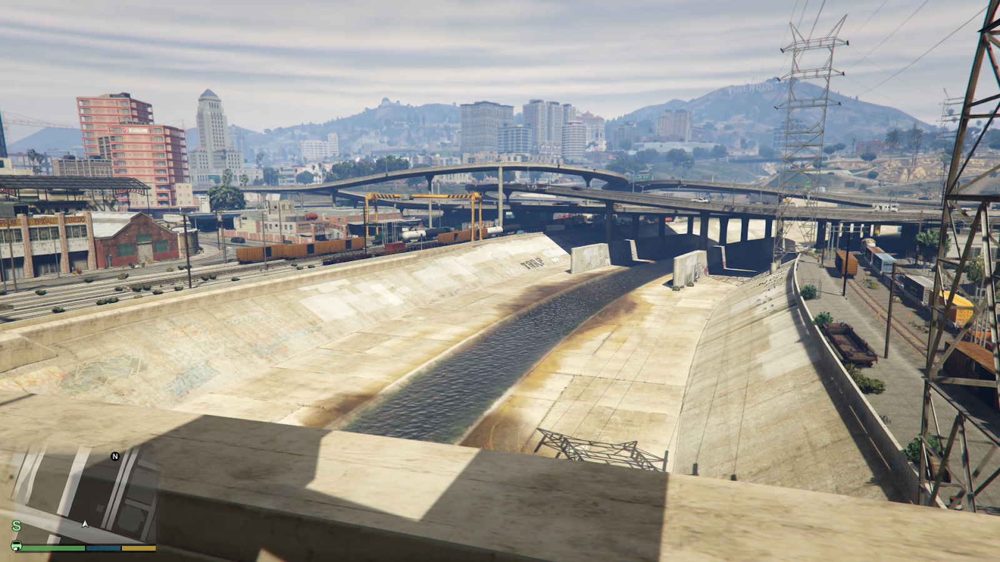

I had a dream about restoring the Los Angeles river. That iconic concrete ditch ate a little piece of my soul every time I drove over it on my way east to Pasadena. It was channelized last century for a very good reason: flood control. But we now understand healthier and more natural ways to mitigate flooding using natural environmental systems. Plus, we know the benefits of green space in cities and the many [services provided by ecosystems](https://www.climatehubs.usda.gov/ecosystem-services).

After a century of urban development I suspect there's barely any room for flood plains or marshes on the borders of the river now. But maybe there is? Maybe we can replace some parking lots with wetlands at the very least.

I'm sure there are local experts on this, and the river situation will vary greatly on its path between the mountains and Long Beach. I want to start by walking the whole thing and documenting what I see. Maybe I'll read a book or two.

*Screenshot of the "Los Santos River" in GTAV via [hakergamin on reddit](https://old.reddit.com/r/GTA/comments/17xhito/hey_guys_does_any_one_know_what_this_place_from/)*