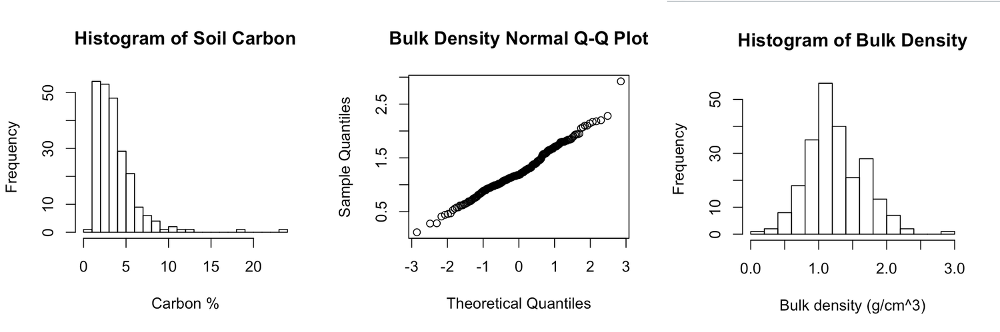
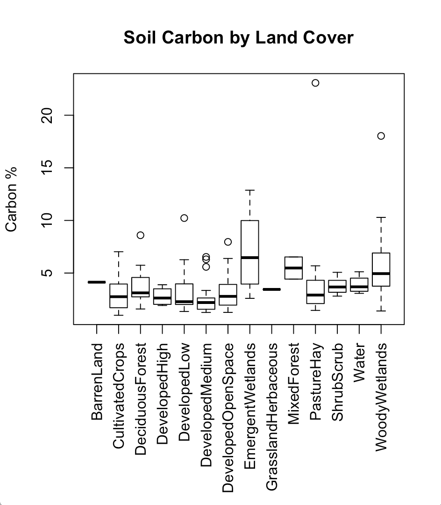
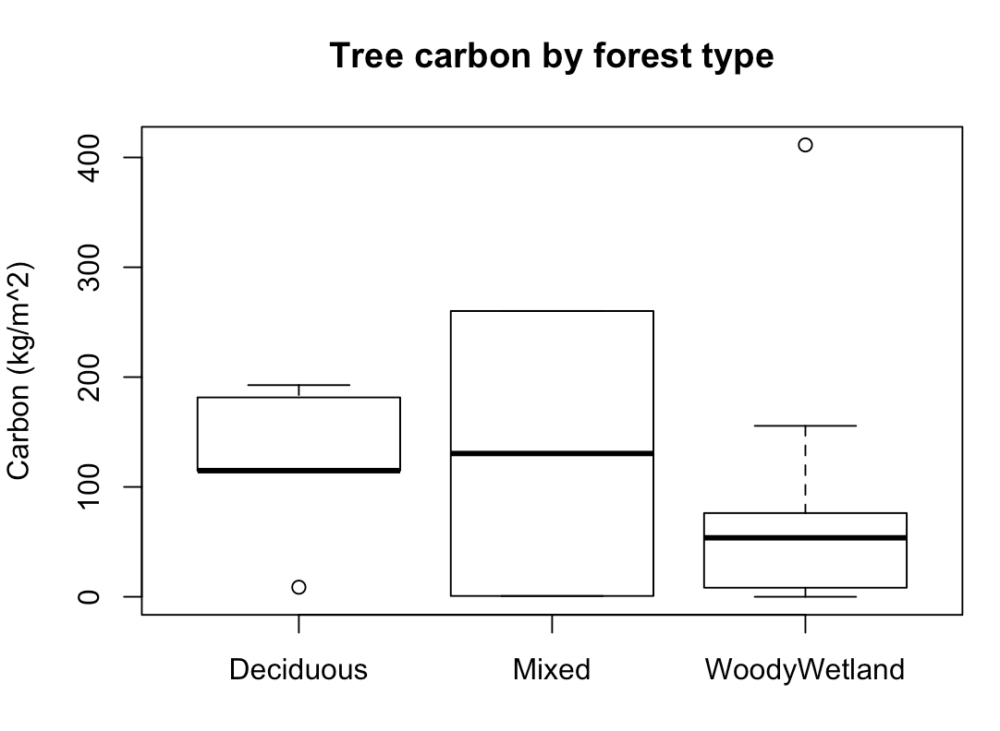
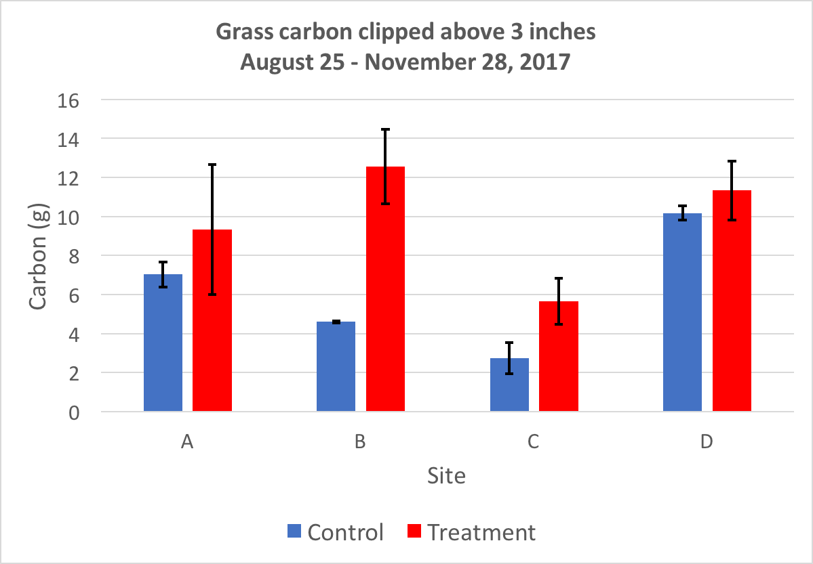
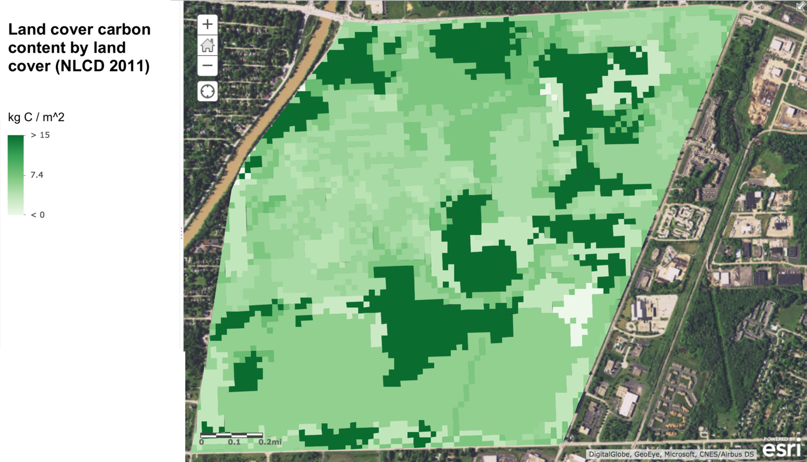
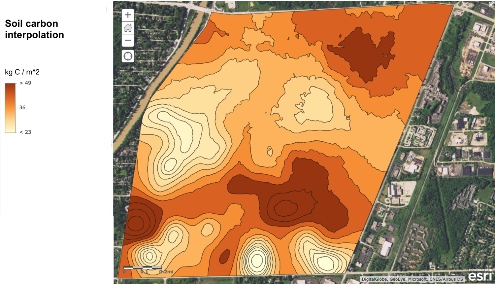
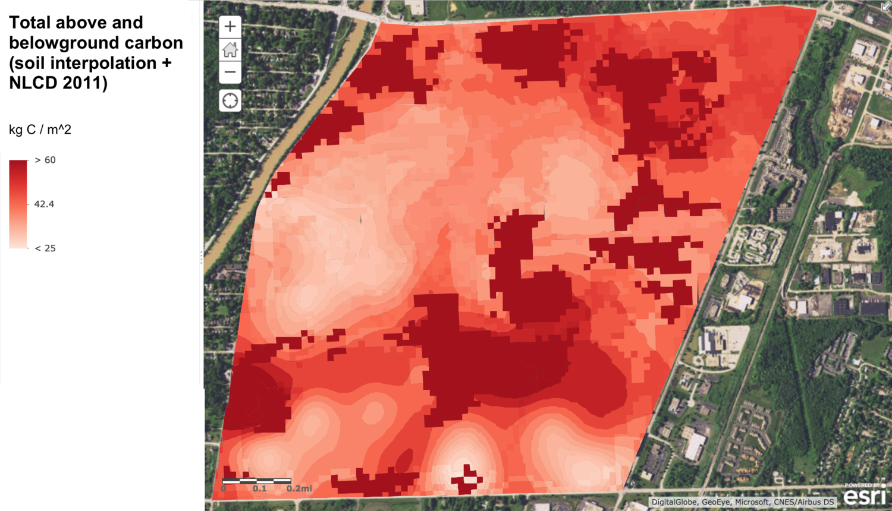

## Abstract

As the climate changes due to anthropogenic greenhouse gas emissions, quantifying the carbon storage capability of our natural resources is only going to become more important. To mitigate its role in climate change, Rochester Institute of Technology (RIT) is seeking to achieve carbon neutrality by 2030. In service of that ultimate goal, the main objective of my senior capstone project at RIT was to identify the carbon storage and sequestration potential of various land covers on campus. To accomplish this, **we sampled soil carbon across RIT’s property and measured vegetation carbon in prominent land covers**. At the end of this year-long project, **I delivered static carbon maps to visualize locations with high carbon storage** for RIT land management decision makers, and **I built a workflow for estimating carbon storage in any location on campus using a custom ArcGIS Online map and an Excel spreadsheet**. Our secondary objective was to collect baseline carbon flux data on campus; for this purpose **we designed and carried out an experiment to compare the carbon sequestration abilities of unmowed and consistently-mowed grass plots**. Our results suggest mowed plots store more carbon, but there are significant caveats. Lastly, we adapted our methods for measuring carbon storage for use by others, including RIT freshmen students and fifth-grade girl scouts, and taught both groups about carbon sequestration and how they can measure it.

## Introduction

Anthropogenic greenhouse gases emissions continue to alter the climate of our planet, increasing the average global temperature, causing glacial retreat, melting arctic ice, and contributing to rising sea levels (IPCC 2014). Climate change is an enormous issue affecting every member of Earth's biosphere, which is why Rochester Institute of Technology (RIT) is trying to do its part by becoming carbon neutral by 2030. To reach this goal, the Senior Sustainability Advisor to the President of RIT asked senior students in the school’s Environmental Science program to develop methods and tools for estimating carbon storage and sequestration across campus. These tools and associated data will allow Ms. Cardinal and other decision makers to more accurately balance the school’s carbon budget.

## Methods

### Soil Carbon

We generated stratified random sample locations based on soil type polygons obtained from the Natural Resources Conservation Service. At each sample site we took three bulk density samples before doing loss on ignition tests to determine the average carbon content (percent) at each location. With bulk density and carbon content data, we calculated the expected below-ground carbon areal density (kilograms Carbon per square meter). I used ArcGIS software to interpolate between hundreds of soil samples, generating a static soil carbon map.

### Tree Carbon

We generated stratified random sample locations based on the type of forest cover as indicated by the 2011 National Land Cover Database, and then measured the height and diameter of every tree within each sample plot. The carbon stored in each tree was estimated using equations found in literature (Tritton and Hornbeck 1982, Lamlom and Savidge 2003). Summing all tree carbon in a plot yielded the desired metric: expected above-ground carbon areal density in kilograms of Carbon per square meter.

### Grass Carbon

We fenced off four unique turf grass plots on campus that fit six quadrats each (three treatment and three control).  Over five months, we clipped the grass in the treatment plots to three inches and collected, dried, and weighed the grass clippings to determine the biomass and carbon accumulated over time. At the end of the study we also clipped the grass in the control quadrats to three inches, and compared the the average carbon sequestered in the treatment quadrats to that of the control quadrats.

### Modeling

To estimate carbon storage in areas we didn't directly sample I did regression analyses in R with different combinations of explanatory variables, including soil type, land cover, and the team gathering the data. I analyzed each potential model based on their R-squared values and the results of ANOVA tests. The linear regression with the best fit was used to create a spreadsheet that calculates total above- and below-ground carbon in an area based on soil type and land cover. I made an interactive map in ArcGIS Online that allows the user to create a custom polygon and calculate the area inside that polygon containing each unique combination of soil type and land cover.

## Results and Discussion

### Soil Carbon

A linear regression analysis of 234 total soil samples collected by my group and a former student revealed that soil type alone accounts for 20.5% of the variation in soil carbon on campus. 

Considering all 234 samples, the histogram on the left in Figure 1 clearly shows that our soil carbon data is heavily skewed to the right. In other words, the vast majority of samples were between 1% and 5% carbon. On the other hand, a Q-Q plot (center) suggests the bulk density of those same samples is normally distributed, with most samples having bulk density around 1-1.5 g/cm3, as seen on the right.

*Figure 1: On the left is a histogram showing the frequency of soil carbon percentages. The center graph shows that the distribution of bulk density values is approximitely normal, and the histogram on the right shows the frequency of soil bulk density values.*

Our soil samples confirmed that emergent and woody wetlands tend to store the most carbon in their soils, as seen below. Developed land covers store the least because there's minimal vegetation to decay and contribute carbon to those soils.

*Figure 2: Carbon content of 234 soil samples by NLCD land cover description. Both types of wetlands have the highest carbon storage capability and developed areas have the lowest.*

### Tree Carbon

Our tree measurements in 21 plots across campus estimate there's 123 kilograms of Carbon per square meter in deciduous forests, 130 in mixed forests (deciduous and evergreen), and 75 in woody wetlands. The wetland forests on campus have much lower tree density than the other two types, leading to this lower carbon density, but it is likely an underestimate. If we developed a method for quantifying carbon in dead tree biomass, which is prolific in the woody wetlands, that value would be much higher.

*Figure 3: The estimated aboveground carbon storage for the different forest types on the RIT campus based on 21 samples.*

### Grass Carbon

The methods that inspired our procedure for measuring grass carbon called for clipping the "stubble" biomass (everything below 3 inches) in a subsection of each quadrat and extrapolating it to the whole quadrat to estimate total biomass and carbon content. We tried this, but found it skewed the results—each subplot was about 69 times smaller than quadrat itself, leaving too much room for error. Our results with just the biomass clipped above 3 inches refute our hypothesis that unmowed plots sequester more carbon; control plots (unmowed) stored significantly more carbon than the treatment plots, as shown in the bar chart below (p=0.098). One caveat regarding result is that data was only collected over half of a growing season; future students working this project should collect data for the entirety of the growing season.

*Figure 4: The amount of carbon (g) clipped above three inches over the course of the study period. Three inches is the typical mowing height used by RIT groundskeeping. Error bars represent one standard deviation. A T-test reveals there is significant difference between the control and treatment sites at the 90% level of significance (p=0.098).*

### Modeling

To model above-ground carbon, we applied the average carbon values calculated from our data or found literature to the matching polygons in the land cover database. The resulting aboveground carbon density map is pictured below. 

*Figure 5: Aboveground carbon content matched to land covers as classified in the 2011 National Land Cover Database (Figure 5). The values for carbon content came from a combination of our own research and literature.*

I used ArcGIS Online to interpolate between the carbon density values measured at the 234 soil points on campus, creating the below-ground carbon map included below.

*Figure 6: A map of soil carbon content on campus interpolated from 234 soil samples. Darker areas are expected to have more carbon in their soils.*

I added the interpolated soil carbon map to the aboveground carbon map, creating a single map for estimating total carbon storage above- and below-ground seen below. This map will allow our client and others making land-use decisions at RIT to quickly visualize areas with high carbon storage, which appear dark red. From a carbon neutrality perspective, lighter areas on the map should be preferred for development, since destroying the vegetation won't contribute as much to RIT's carbon deficit.

*Figure 7: Total above- and below-ground carbon in kg/m2. This is a combination of the interpolated soil map (Figure 6) and the NLCD 2011 aboveground carbon map (Figure 5).*

A linear regression analysis including soil carbon, land cover, and an interaction term between them as the explanatory variables found they explain 27% of the variation in soil carbon on campus (adjusted R-squared = 0.27). ANOVA analysis of this regression shows that both soil type and the interaction term are significant predictors (p < 0.001 and p = 0.07253, respectively) but land cover is not a great predictor (p = 0.13598). We think the low-resolution (30 meter pixels) 2011 National Land Cover Database is a factor in that variable's  low predictive value; [in another project](/land-cover-classification), I created a better land cover database for RIT that will hopefully improve this model.

I integrated the regression equation into an Excel spreadsheet that our client can use to estimate total above- and below-ground carbon inside a polygon she draws in ArcGIS Online. Access to this online tool is restricted to RIT students and employees.

## Conclusion

Analysis of our soil samples revealed soil type and land cover are the known driving factors for soil carbon storage, but together they only account for less than 30% of soil carbon variation, according to our regression analysis. Further work must be conducted to determine what variables can explain the remaining variation in soil carbon storage. A comparison of mowed and unmowed grass found that mowed plots stored significantly more carbon than the unmowed plots from August through November 2017, refuting our hypothesis. Deciduous and mixed forests at RIT store more carbon than wetland forests, likely due to their higher density. Our fieldwork and analysis culminated in two major deliverables our client can use. First, there's the total above- and below-ground carbon density map displayed in Figure 7 above clearly highlight the areas on campus with the highest carbon storage capabilities. Our client can use that map to defend carbon-dense areas from development as she seeks to meet RIT’s carbon neutrality target. Second, we delivered an interactive ArcGIS Online map that can be used in combination with a provided Excel spreadsheet to estimate total carbon storage in a user-selected area on campus. Land management decision makers can use this to compare the carbon impacts of developing different areas of campus. Together, these tools will allow our client and other RIT officials to make well informed, strategic land alteration decisions to meet the carbon neutrality goal set forth in RIT's Climate Action Plan.

Future RIT students who pick up this project should test the accuracy of our model by measuring above- and below-ground carbon storage in randomly-generated sampling locations all across campus. We completed our model right before we graduated, so the next group should prioritize the collection of ground truth data for testing purposes. They should also measure carbon storage in prominent land covers we did not test, like emergent wetlands and shrublands, and in carbon pools we didn't include, like dead biomass and root systems.

## References

IPCC, 2014: Climate Change 2014: Synthesis Report. Contribution of Working Groups I, II and III to the Fifth Assessment Report of the Intergovernmental Panel on Climate Change [Core Writing Team, R.K. Pachauri and L.A. Meyer (eds.)]. IPCC, Geneva, Switzerland, 151 pp. [http://www.ipcc.ch/report/ar5/syr/](http://www.ipcc.ch/report/ar5/syr/)

Lamlom, S. H., & Savidge, R. A. (2003). A reassessment of carbon content in wood: variation within and between 41 North American species. Biomass and Bioenergy, 25(4), 381-388. [http://www.sciencedirect.com/science/article/pii/S0961953403000333](http://www.sciencedirect.com/science/article/pii/S0961953403000333)

Tritton, Louise M.; Hornbeck, James W. (1982). Biomass equations for major tree species of the Northeast. Gen. Tech. Rep. NE-69. Broomall, PA: U.S. Department of Agriculture, Forest Service, Northeastern Forest Experimental Station, 46.