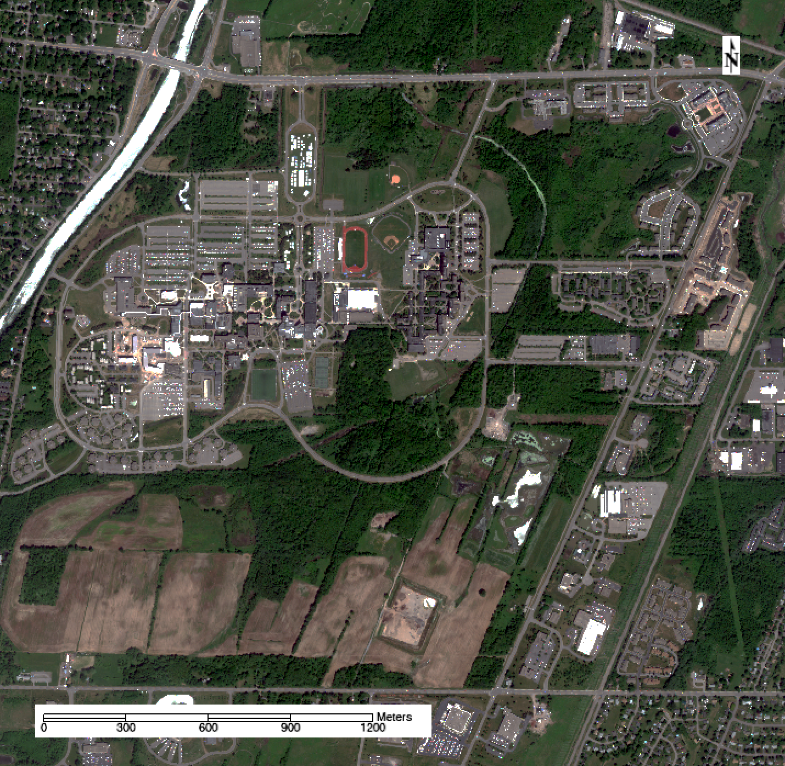
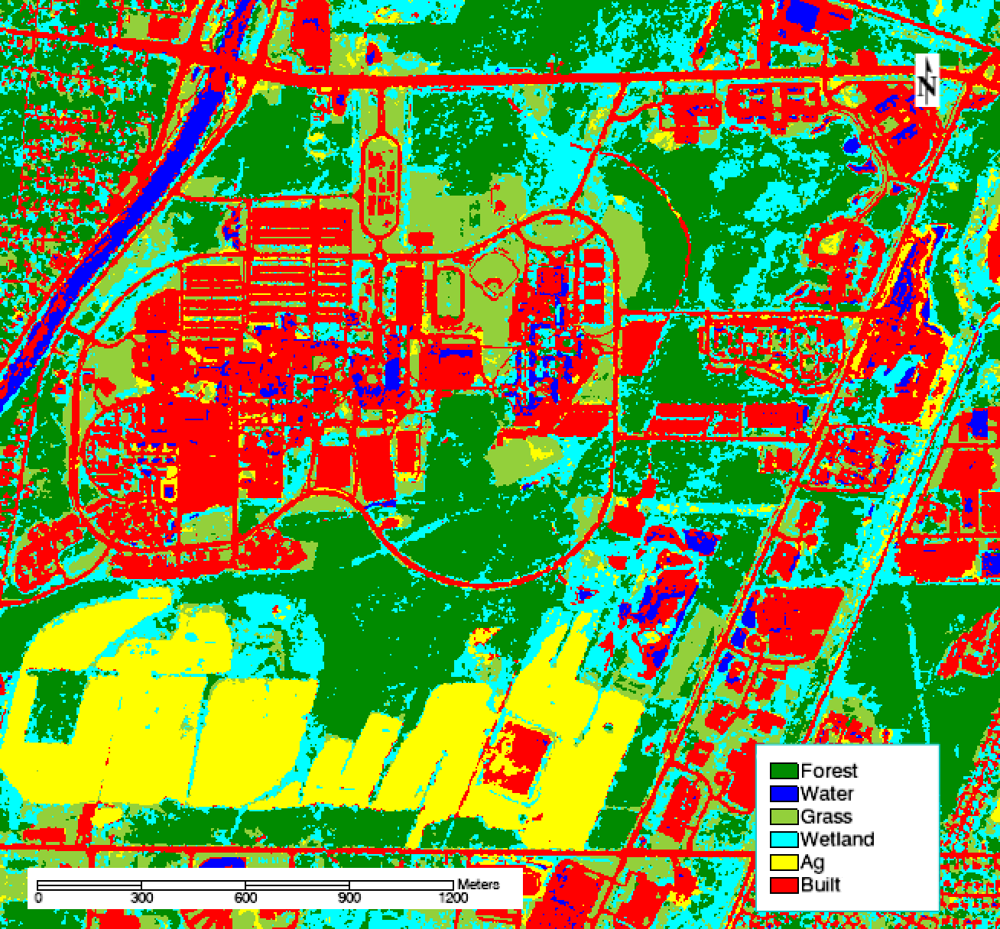
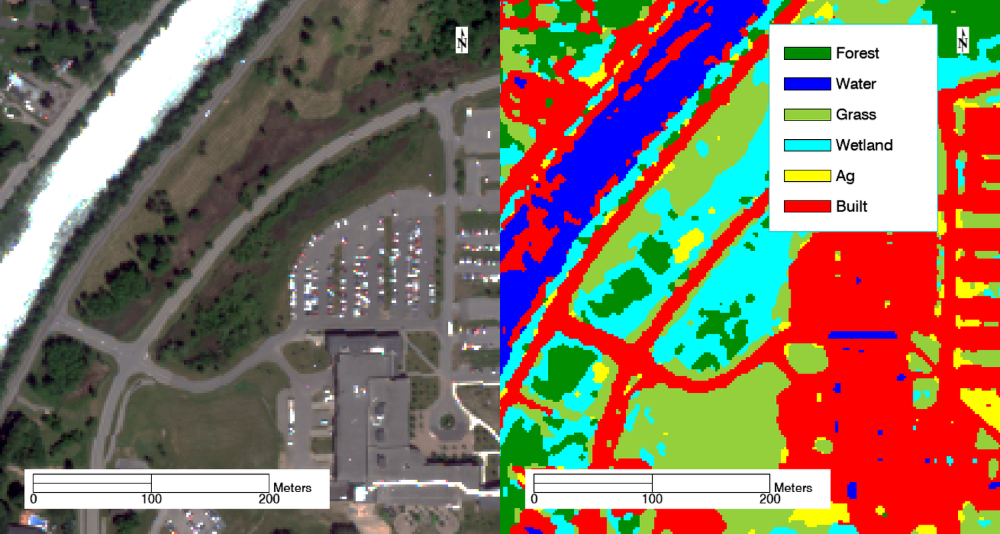
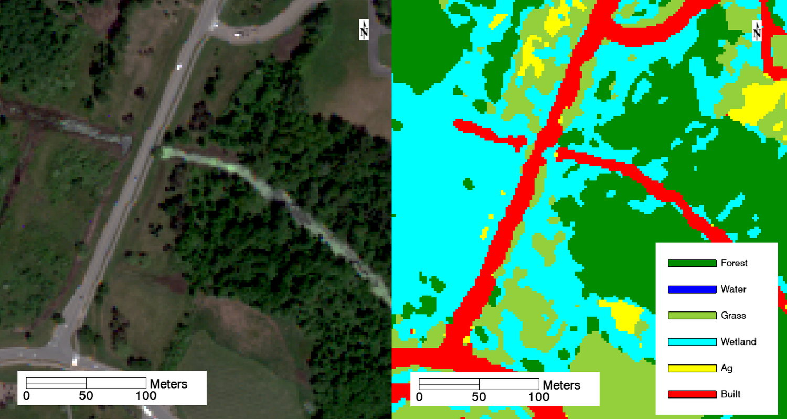
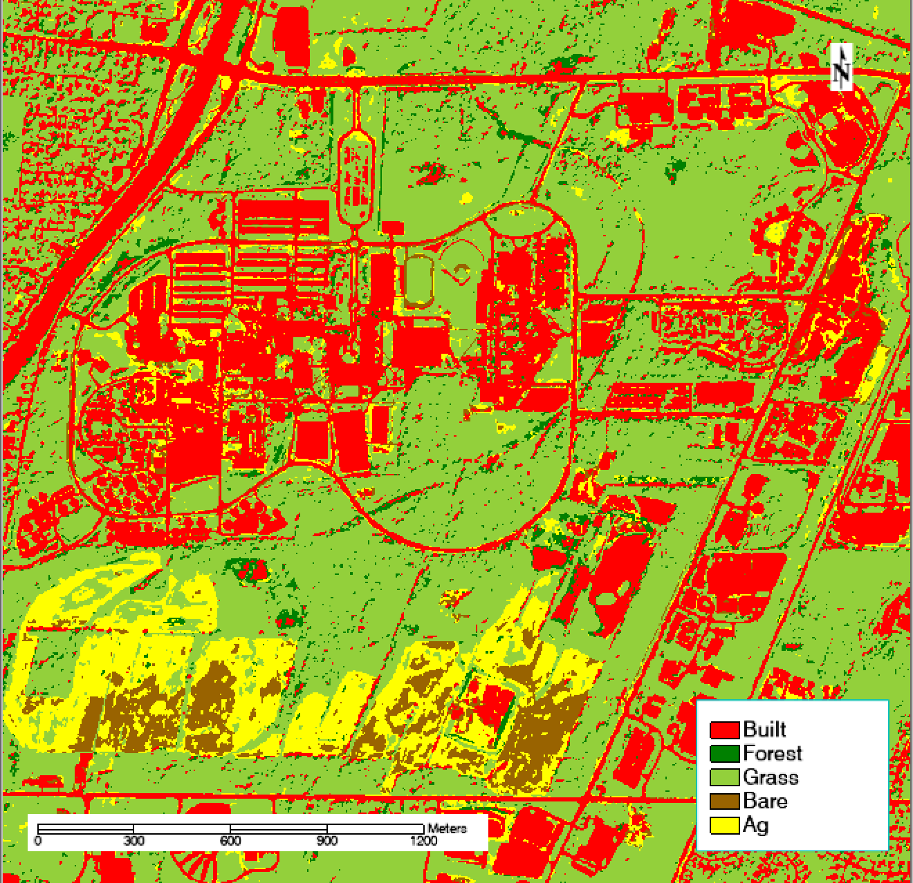
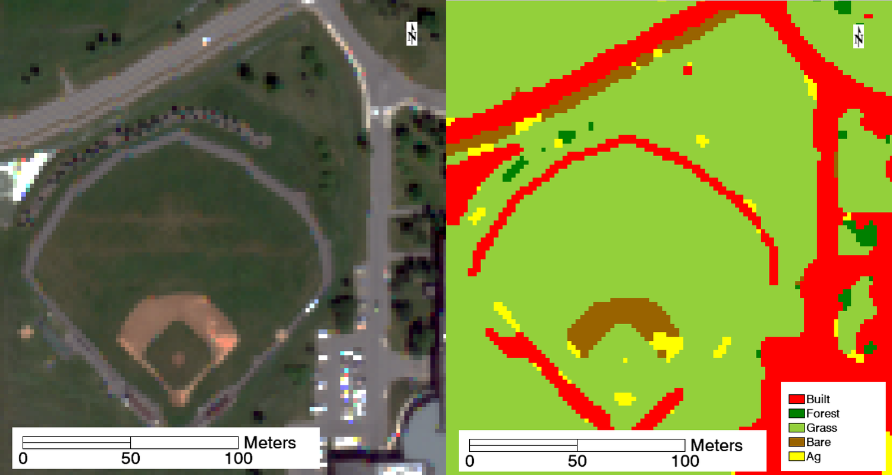

## Abstract

To reach its goal of being carbon neutral by 2030, Rochester Institute of Technology (RIT) needs to quantify the carbon storage and sequestration capabilities of its land. The school enlisted undergraduate Environmental Science students to model carbon storage and fluxes on campus; the best models we created in 2017 depend heavily on a low spatial resolution (30 meter pixel size) land cover database. To improve our carbon models, **I created, tested, and refined supervised and unsupervised land cover classifications of the RIT campus** from high-resolution (2 meter) multispectral WorldView-2 imagery. The best result was a supervised classification estimated to be about 82% accurate overall. This new land cover database should be used by students who pick up RIT's carbon modeling project going forward.

*Figure 1: 2010 WorldView-2 imagery of RIT's campus.*

## Introduction

For all of 2017,  I worked with another student on a [capstone project](/capstone). We were limited by the land cover databases available to us. We used the 2011 National Land Cover Database to generate stratified random carbon sampling locations and to estimate carbon storage within subsections of campus. However, the NLCD 2011 has very large 30 meter by 30 meter pixels, which are not fine enough to pick up the land cover variations that occur on campus, which is only about two kilometers wide. One deliverable for the project was a model for predicting soil carbon based on soil type and land cover. With NLCD 2011 land cover database and hundreds of soil samples, the best model we generated accounted for less than 40% of the variation within soil carbon storage on campus. In this project I sought to make a more accurate, higher-resolution land cover database that will hopefully increase the accuracy of that soil carbon model.

## Methods

The highest-resolution multispectral (or better) imagery covering the whole RIT campus is WorldView 2 imagery from September 2010, which has about a 2 meter by 2 meter spatial resolution and eight bands: five in the visible spectrum, one at the red edge, and two near-infrared bands (Satellite Imaging Corp). 

Using ENVI 5.4 I selected polygon training sites in the prominent classes my partner and I studied for our capstone project: forest, water, grass, wetland, agriculture, and built environment. Several training sites were spatially spread out in each land cover in order to adequately account for the variation within every class.

I calculated the separability of the pixels selected in each class of training sites to verify that the classes were distinguishable, and generated a maximum likelihood classification. I removed the visual noise from the result with a 3x3 pixel majority filter applied twice over. Separate from the training sites, I marked at least 20 truth pixels for each class where I knew the correct classification from experience. To quantitatively test the quality of each iterative version of my classification, I generated a confusion matrix, which calculated accuracy based on the truth pixels I selected. I visually inspected the results of each classification to search for flaws, refined the training sites accordingly, and iterated until the classification was qualitatively and quantitatively accurate.

I also generated unsupervised classifications using the ISODATA classification tool, experimenting with different numbers of classes and constraints on those classes (Ball and Hall, 1965). Once decent land cover separation was achieved, I started combining classes of the same land covers until I reached nearly the same set of classes as the supervised classification. Noise was reduced in the resulting unsupervised classification using the same method (3x3 pixel majority filter, twice) and the same truth data points were used to generate a confusion matrix. I qualitatively compared the best unsupervised classification to the best supervised classification by evaluating their confusion matrices and exported the best option as a TIFF image for future use in GIS.

## Results and Discussion

I iterated six times on the initial training sites to improve the separability of the classes and increase overall accuracy of the supervised classification. The first version was just over 40% accurate, but the final supervised classification pictured below is estimated to be about 82% accurate overall. The kappa coefficient, which measures the accuracy of the classification compared to the accuracy of a classification randomly generated based on the frequency of classes, is 0.78. This suggests the classification is substantially better than a random classification (Landis and Koch 1977).

*Figure 2: The final supervised classification of RIT’s campus, which is estimated to be 81.8% accurate overall.*

Several land covers were consistently confused throughout the process. Water was mixed in with built objects—specifically, the roofs of buildings. The pair separation between those training sets was just 1.70, lower than the target values of 1.90. I refined, removed, and added training sites to eliminate much of this confusion. However, many buildings’ roofs and shadows on campus remain incorrectly classified as water, and plenty of water is misclassified as built, as seen in the image below. These errors are not unexpected, however, because water and roofs are highly absorbent materials that appear very dark in several bands, especially the near infrared bands. Additionally, sediment suspended in water can make the spectral profile of water closer to that of building materials like brick and concrete.

*Figure 3: Confusion between water and built classes. Parts of the river in the northwest corner are misclassified as built environment, and the shadows of the building in the southeast are misclassified as water.*

Additionally, wetlands were often mixed up with forest and grass. The pair separation between wetland and forest was 1.70, and 1.82 between wetland and grass. This confusion also makes sense; all three land covers consist of vegetation, only differing between species and moisture. Wetter forests and grass fields are expectedly classified as wetlands. This is arguably correct, since much of campus was converted from wetlands to other land covers, and there’s often standing water in areas that RIT does not treat as true wetlands. For example, the area on either side of the road in the image below always contains standing water for some time after a rain event. Therefore, much of it is classified as a wetland instead of grass and forest. Notice that the stream running east-west is also misclassified as built.

*Figure 4: Confusion between wetland, forest, and grass land covers. Wetter forested and grassy areas are classified as wetland instead.*

A confusion matrix (Table 1, below) for this classification calculated from the truth pixels established for each land cover shows this class melding as well. Notably, the user’s accuracy for both water and is just 71%, meaning a user who went to a “built” pixel as designated by this classification would only find actual built environment 71% of the time. The same is true for water. And the user's accuracy for wetland is only 65%. Although the overall accuracy of the classification is high, there are a few classes that are significantly less accurate. The “Built” column confirms that built environments are often mistaken for water; 5 of the 20 pixels containing confirmed built environment were misclassified as water. Wetland ground truth pixels were mistaken for water, grass, agriculture, and built. Classifying wetlands remains challenging with this imagery.

Table 1: Confusion matrix for the supervised classification. Numbers on the diagonal (where the column and row labels match) count the ground truth pixels that were correctly classified.

<table>
<thead>
<tr>
<th></th>
<th><strong>Truth</strong></th>
<th></th>
<th></th>
<th></th>
<th></th>
<th></th>
<th></th>
<th></th>
<th></th>
</tr>
</thead>
<tbody>
<tr>
<td><strong>Classification</strong></td>
<td><strong>Forest</strong></td>
<td><strong>Water</strong></td>
<td><strong>Grass</strong></td>
<td><strong>Wetland</strong></td>
<td><strong>Agriculture</strong></td>
<td><strong>Built</strong></td>
<td><strong>Total</strong></td>
<td><strong>User's accuracy</strong></td>
<td><strong>Comission error</strong></td>
</tr>
<tr>
<td><strong>Forest</strong></td>
<td>16</td>
<td>0</td>
<td>0</td>
<td>0</td>
<td>0</td>
<td>0</td>
<td>16</td>
<td>100%</td>
<td>0%</td>
</tr>
<tr>
<td><strong>Water</strong></td>
<td>0</td>
<td>15</td>
<td>0</td>
<td>1</td>
<td>0</td>
<td>5</td>
<td>21</td>
<td>71%</td>
<td>29%</td>
</tr>
<tr>
<td><strong>Grass</strong></td>
<td>0</td>
<td>0</td>
<td>20</td>
<td>1</td>
<td>0</td>
<td>0</td>
<td>21</td>
<td>95%</td>
<td>5%</td>
</tr>
<tr>
<td><strong>Wetland</strong></td>
<td>4</td>
<td>2</td>
<td>0</td>
<td>15</td>
<td>2</td>
<td>0</td>
<td>23</td>
<td>65%</td>
<td>35%</td>
</tr>
<tr>
<td><strong>Agriculture</strong></td>
<td>0</td>
<td>0</td>
<td>0</td>
<td>1</td>
<td>18</td>
<td>0</td>
<td>19</td>
<td>95%</td>
<td>5%</td>
</tr>
<tr>
<td><strong>Built</strong></td>
<td>0</td>
<td>4</td>
<td>0</td>
<td>2</td>
<td>0</td>
<td>15</td>
<td>21</td>
<td>71%</td>
<td>29%</td>
</tr>
<tr>
<td><strong>Total</strong></td>
<td>20</td>
<td>21</td>
<td>20</td>
<td>20</td>
<td>20</td>
<td>20</td>
<td>121</td>
<td></td>
<td></td>
</tr>
<tr>
<td><strong>Producer's accuracy</strong></td>
<td>80%</td>
<td>71%</td>
<td>100%</td>
<td>75%</td>
<td>90%</td>
<td>75%</td>
<td></td>
<td></td>
<td></td>
</tr>
<tr>
<td><strong>Omission error</strong></td>
<td>20%</td>
<td>29%</td>
<td>0%</td>
<td>25%</td>
<td>10%</td>
<td>25%</td>
<td></td>
<td></td>
<td></td>
</tr>
</tbody>
</table>

I generated unsupervised classifications using a wide variety of parameters, adjusting the number of and relatedness of classes. With just 10 initial classes, many vegetation land covers were lumped together in the same classes. With 20 classes, individual vegetation types were more distinguishable, but when I tried to combine 20 classes down into the same six classes in the supervised classification, I found that most of the 20 classes still did not clearly map to one land cover. The final unsupervised classification, shown below, reveals that almost all the vegetation land covers were merged into the grass class. The classification has other problems as well: neither water nor wetlands appeared in their own class.

*Figure 5: The final unsupervised classification of RIT’s campus, which is estimated to be 65.3% accurate overall.*

One advantage of this classification is the addition of a unique class for bare earth, which was correctly detected in some of the sparsely-covered farm fields in the south of the image above, in various construction sites on campus, and in the baseball field, pictured below.

*Figure 6: The unsupervised classification included a bare earth class which correctly found features like the infield base paths and the worn-down path on the edge of the road.*

Overall, the unsupervised classification is just 65.3% accurate with a kappa coefficient of 0.53, which is significantly worse than the supervised classification. The confusion matrix in Table 2 shows that this classification is great at separating built and natural land covers (100% producer’s accuracy for built pixels) but terrible at distinguishing between those natural land covers. About 52% of pixels classified as grass are not actually grass.

Table 2: Confusion matrix for the unsupervised classification. Numbers on the diagonal (where the column and row labels match) count the ground truth pixels that were correctly classified.

<table>
<thead>
<tr>
<th></th>
<th><strong>Truth</strong></th>
<th></th>
<th></th>
<th></th>
<th></th>
<th></th>
<th></th>
</tr>
</thead>
<tbody>
<tr>
<td><strong>Classification</strong></td>
<td><strong>Built</strong></td>
<td><strong>Forest</strong></td>
<td><strong>Grass</strong></td>
<td><strong>Agriculture</strong></td>
<td><strong>Total</strong></td>
<td><strong>User's accuracy</strong></td>
<td><strong>Comission error</strong></td>
</tr>
<tr>
<td><strong>Built</strong></td>
<td>19</td>
<td>2</td>
<td>0</td>
<td>1</td>
<td>22</td>
<td>86%</td>
<td>14%</td>
</tr>
<tr>
<td><strong>Forest</strong></td>
<td>0</td>
<td>1</td>
<td>0</td>
<td>1</td>
<td>2</td>
<td>50%</td>
<td>50%</td>
</tr>
<tr>
<td><strong>Grass</strong></td>
<td>0</td>
<td>17</td>
<td>20</td>
<td>5</td>
<td>42</td>
<td>48%</td>
<td>52%</td>
</tr>
<tr>
<td><strong>Agriculture</strong></td>
<td>0</td>
<td>0</td>
<td>0</td>
<td>9</td>
<td>9</td>
<td>100%</td>
<td>0%</td>
</tr>
<tr>
<td><strong>Total</strong></td>
<td>19</td>
<td>20</td>
<td>20</td>
<td>16</td>
<td>75</td>
<td></td>
<td></td>
</tr>
<tr>
<td><strong>Producer's accuracy</strong></td>
<td>100%</td>
<td>85%</td>
<td>100%</td>
<td>56%</td>
<td></td>
<td></td>
<td></td>
</tr>
<tr>
<td><strong>Omission error</strong></td>
<td>0%</td>
<td>15%</td>
<td>0%</td>
<td>44%</td>
<td></td>
<td></td>
<td></td>
</tr>
</tbody>
</table>

## Conclusion

With an overall accuracy of 81.8% and a kappa value of 0.78, the supervised classification is quantitatively superior to the unsupervised classification, which is just 65.3% accurate with a kappa value of 0.53. The supervised classification is also superior qualitatively; it’s more in line with ground truth based on my experience sampling soil all over campus as part of my capstone project. Future Environmental Science students who join that capstone project should use my supervised classification instead of the National Land Cover Database for estimating carbon storage and sequestration. The finer resolution of this classification (2 meters vs 30 meters) and the classes tailored specifically to the purposes of the project give it a clear edge. However, as discussed above, the classification is nowhere near perfect. Future work could involve mitigating notable issues like the water/built confusion. Additionally, the classification is based on imagery from 2010, and RIT’s campus has changed significantly since then. When new high-resolution imagery is available, this analysis should be repeated to produce a more up-to-date classification.

## References

Ball, G. H., & Hall, D. J. (1965). ISODATA, a novel method of data analysis and pattern classification. Stanford research inst Menlo Park CA.
Chicago    

Landis, J. R., & Koch, G. G. (1977). The measurement of observer agreement for categorical data. biometrics, 159-174.

WorldView-2 Satellite Sensor. Satellite Imaging Corp. Retrieved December 15, 2017, from [https://www.satimagingcorp.com/satellite-sensors/worldview-2/](https://www.satimagingcorp.com/satellite-sensors/worldview-2/)